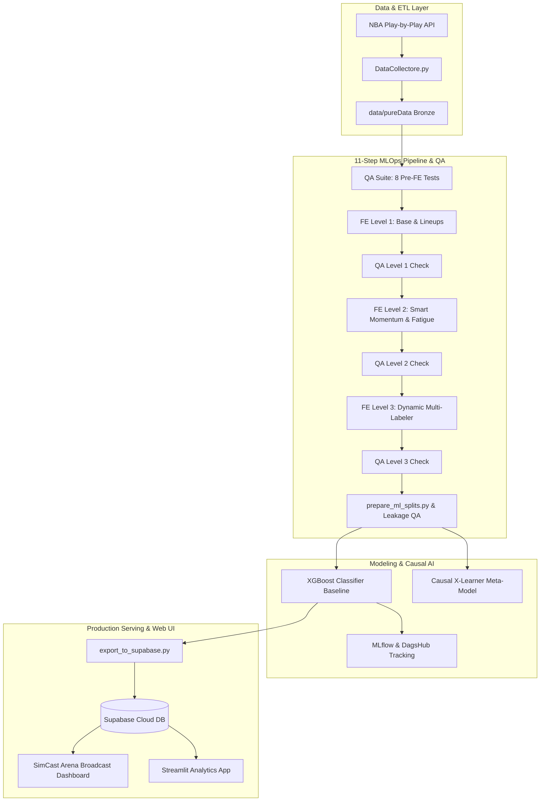

# NBA-AI-Coach: Real-Time Tactical Timeout Optimization

[](https://github.com/davidkorenblit/nba-ai-coach-assistant/actions)
[](https://davidkorenblit.github.io/nba-ai-coach-assistant/)
[](https://dagshub.com/davidkorenblit/nba-ai-coach-assistant)
[](https://supabase.com)

> 🚀 **Live Demo Available:** Experience the interactive broadcast simulator instantly here: **[SimCast Arena Dashboard](https://davidkorenblit.github.io/nba-ai-coach-assistant/)**

---

## 📌 Executive Summary

The **NBA AI Coach Assistant** is an end-to-end Machine Learning and Causal Inference Decision Support System (DSS) designed to assist NBA coaching staffs in making data-validated timeout calls. 

By transforming raw event-stream data into a 4-layer analytical framework, the system quantifies game momentum, explosiveness, and player fatigue. It combines predictive modeling (XGBoost) with **Causal Inference (X-Learner)** to isolate the true treatment effect of a timeout and recommend the optimal moment to intervene.

---

## 📐 End-to-End System Architecture



---

## ⚡ Quickstart & Installation

Follow these steps to clone the repository and run the full environment locally:

### 1. Clone the Repository
```bash
git clone https://github.com/davidkorenblit/nba-ai-coach-assistant.git
cd nba-ai-coach-assistant
```

### 2. Set Up Virtual Environment & Install Dependencies
```bash
# Create virtual environment
python -m venv venv

# Activate virtual environment (Windows)
.\venv\Scripts\activate
# On macOS/Linux: source venv/bin/activate

# Install all required packages
pip install -r requirements.txt
```

### 3. Run the Applications

#### 🌐 Option A: SimCast Arena Broadcast Simulator (`index.html`)
* **Instant Hosted Version:** Visit **[SimCast Arena Dashboard](https://davidkorenblit.github.io/nba-ai-coach-assistant/)**
* **Local HTTP Server:**
  ```bash
  python -m http.server 8000
  ```
  Then open `http://localhost:8000` in your web browser.

#### 📊 Option B: Streamlit Analytics App (`app.py`)
```bash
streamlit run app.py
```
Open `http://localhost:8501` to explore CATE scores, propensity weights, and period-by-period tactical breakdowns.

---

## 🔄 End-to-End MLOps Pipeline (GitHub Actions)

The project includes an **11-step automated MLOps pipeline** configured in `.github/workflows/mlops_pipeline.yml`:

1. **Raw Data Ingestion:** `DataCollectore.py` with Akamai TLS session & Proxy support.
2. **QA Pre-FE Suite:** `run_all_tests.py` running 8 data integrity tests.
3. **FE Level 1:** `01_build_level1_base.py` (dynamic timeline & lineup inference).
4. **QA Level 1:** Quality and structural integrity checks.
5. **FE Level 2:** `02_build_level2_momentum.py` (Smart Momentum, Fatigue & Explosiveness).
6. **QA Level 2:** Non-linear metric quality checks.
7. **FE Level 3:** `03_build_level3_labels.py` (Multi-window target labeler).
8. **QA Level 3:** Target label distribution checks.
9. **ML Splits & Leakage QA:** Game-level chronological splitting + zero-leakage validation.
10. **Model Training & MLflow:** Training XGBoost models and logging artifacts to **DagsHub**.
11. **Supabase Export:** Pushing Gold predictions to **Supabase PostgreSQL Cloud DB**.

---

## 🛠️ Tech Stack & Technical Standards

* **Core Language & Science:** Python 3.10+, Pandas, NumPy, Scikit-Learn, XGBoost, EconML
* **MLOps & Data Pipeline:** GitHub Actions, DagsHub, MLflow, DVC, Supabase (PostgreSQL)
* **API Ingestion:** `nba_api`, `curl_cffi` (Chrome TLS Impersonation & Akamai WAF Bypass)
* **Web Interfaces:** HTML5, Vanilla CSS, JavaScript (Chart.js), Streamlit
* **Code Quality & Integrity:** OOP architecture, 100% vectorized calculations, strict assertion-based QA validators.

---

## 📁 Repository Structure

* [`models/`](file:///c:/Users/david/finalPro/models): XGBoost baseline models, Causal X-Learner, data splitting, and recommendation engine.
* [`scripts/`](file:///c:/Users/david/finalPro/scripts): Data collector, feature engineering pipeline (Levels 1–3), QA test suite, and Supabase exporter.
* [`docs/`](file:///c:/Users/david/finalPro/docs): Executive summary and technical documentation.
* [`index.html`](file:///c:/Users/david/finalPro/index.html) & [`js/`](file:///c:/Users/david/finalPro/js): SimCast Arena broadcast simulator web interface.
* [`app.py`](file:///c:/Users/david/finalPro/app.py): Streamlit interactive analytics application.