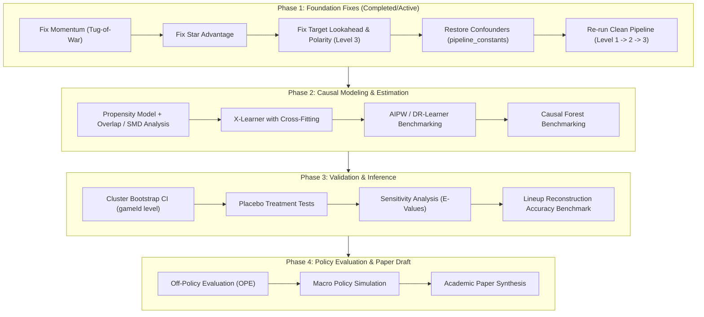

# 🔍 NBA AI Coach: Comprehensive Codebase Audit & Academic Roadmap

> **Document Version:** 1.0  
> **Author:** David Korenblit & Research AI Pair  
> **Context:** Preparing the undergraduate capstone project (*NBA AI Coach / Causal Decision Support*) for peer-reviewed academic publication.

---

## Executive Summary

1. **Demo Code Isolation:** All presentation and frontend simulation files (`app.py`, `prepare_demo_data.py`, `context_rules.md`, `validate_logs.py`) represent software engineering artifacts and UI mocks. They are completely separated from the scientific empirical pipeline.
2. **Core Architecture Validation:** The underlying data collection (4 full NBA seasons of play-by-play data, ~900MB), the 3-tier pipeline structure (`Level 1 -> Level 2 -> Level 3`), and the X-Learner meta-learning architecture provide a sound technical foundation.
3. **Identified Methodological Defects:** The audit identified 5 critical bugs in Feature Engineering and Causal Modeling that require correction before re-running experiments:
   - Directionless Momentum (Fixed: converted to Tug-of-War continuous gauge).
   - Star Resting Symmetry (Fixed: converted to differential `star_advantage`).
   - Horizon Lookahead Boundary Distortion at period ends.
   - Target Polarity Inversion (`interest_sign`).
   - Omitted Confounder Bias (`seconds_remaining`).
4. **Academic Cross-Reference:** The external recommendations provided by Dr. Rachel Shapira (CATE focus, Propensity Overlap, AIPW/Causal Forest estimators, Cluster Bootstrap CI, Placebo tests, Lineup accuracy, and Off-Policy Evaluation) are 100% methodologically sound and form our exact post-fix roadmap.

---

## Part 1: Detailed Codebase Vulnerabilities & Resolutions

### 1. Feature Engineering: Momentum & Tactical Features

#### Bug #1: Directionless Momentum (RESOLVED)
- **File:** `scripts/feature_engineering/02_build_level2_momentum.py`
- **Defect:** `event_momentum_val` previously accumulated positive points for made shots, steals, and blocks without identifying whether the Home or Away team executed them. This produced an undirected "game intensity" metric rather than a true team momentum streak.
- **Resolution:** Refactored into a **Dual Momentum Streak with a Continuous Tug-of-War Gauge**:
  - Home positive actions (`3pt: +1.5`, `2pt: +1.0`, `steal: +2.0`, `block: +1.5`, `tech_foul_opp: +2.5`) increment `home_momentum_streak` and subtractively erode `away_momentum_streak` (`max(0.0, away - val)`).
  - Away positive actions increment `away_momentum_streak` and erode `home_momentum_streak`.
  - Stored as `home_momentum_streak`, `away_momentum_streak`, and `momentum_delta = home - away`.

#### Bug #2: Horizon Lookahead Boundary Distortion (PENDING)
- **File:** `scripts/feature_engineering/03_build_level3_labels.py`
- **Defect:** `pd.merge_asof` partitions lookahead by `period`. In the final 90s and 180s of each quarter, no future row exists within the period, causing `fillna(current_value)` to artificially force `delta = future - current = 0`. This injects ~25% synthetic zeros into outcome targets.
- **Planned Fix:** Either implement global elapsed game seconds across quarter boundaries or explicitly mask/filter boundary events where the full evaluation window cannot be completed.

#### Bug #3: Target Polarity Inversion via `interest_sign` (PENDING)
- **File:** `scripts/feature_engineering/03_build_level3_labels.py`
- **Defect:** `interest_sign = np.where(score_margin > 0, -1, 1)` inverts outcome delta based on who is leading at that instant, rather than which team initiated the timeout/action. A leading team calling a timeout and expanding their lead is erroneously labeled as a negative outcome.
- **Planned Fix:** Ground outcome deltas strictly from the perspective of the acting/timeout-calling team (`acting_team_id`).

#### Bug #4: Star Advantage Symmetry (RESOLVED)
- **File:** `scripts/feature_engineering/02_build_level2_momentum.py`
- **Defect:** `is_star_resting` was defined as `~(home_has_star | away_has_star)`, returning 1 only when *neither* team had a star, losing team identity.
- **Resolution:** Replaced with `star_advantage = home_has_star.astype(int) - away_has_star.astype(int)` (`+1` = Home advantage, `0` = Parity, `-1` = Away advantage).

#### Bug #5: Substitution Timer Team Leakage (PENDING)
- **File:** `scripts/feature_engineering/01_build_level1_base.py`
- **Defect:** `time_since_last_sub` combines `home_lineup + "|" + away_lineup`. A substitution by Away resets the fatigue timer for Home.
- **Planned Fix:** Track independent substitution clocks per team (`time_since_last_sub_home`, `time_since_last_sub_away`).

---

## Part 2: Causal Modeling & Statistical Rigor

### Omitted Confounder Bias
- **File:** `models/pipeline_constants.py`
- **Defect:** `v2_aggressive_clean` blacklisted `seconds_remaining`. In basketball, game clock is the single largest driver of timeout selection (TV timeouts, quarter-end clock management). Omitting it violates the Unconfoundedness assumption ($Y(0), Y(1) \perp T \mid X$).
- **Planned Fix:** Restore `seconds_remaining` (and categorical clock bins) to the propensity and outcome models.

### Causal Estimator Expansion
- **Current:** Single X-Learner implementation with XGBoost.
- **Planned:**
  - Implement Double Machine Learning (DML) / Augmented Inverse Probability Weighting (AIPW) via `EconML` / `DoWhy`.
  - Implement Causal Forest (Generalized Random Forests) as an orthogonal non-parametric benchmark.
  - Apply 5-Fold Cross-Fitting to eliminate in-sample counterfactual imputation bias.

### Statistical Inference & Uncertainty
- Compute Cluster Bootstrap Confidence Intervals at the **`gameId` level** (1,000 resamples) to account for intra-game possession autocorrelation.
- Report standard errors and 95% CIs for ATE, CATE quintiles, and policy values.

### Robustness & Sensitivity Analysis
- **Placebo Tests:** Introduce randomized mock timeout allocations to verify the null effect hypothesis on placebo data.
- **Sensitivity Bounds:** Compute Rosenbaum bounds or E-Values to assess robustness against unobserved confounding.

---

## Part 3: Policy & Off-Policy Evaluation (OPE)

### Replacement of Flawed Opportunity Cost Heuristics
- **Defect:** Comparing `complied.mean() - ignored.mean()` in observational data reintroduces selection bias and suffers from tiny sample sizes ($N < 10$).
- **Resolution:** Discontinue observational mean comparisons. Implement Doubly Robust Off-Policy Evaluation (OPE) comparing:
  1. **Trained CATE DSS Policy:** Call timeout when $\widehat{CATE}(X) \ge \theta^*$.
  2. **Actual Coach Policy:** Empirical historical decisions.
  3. **Heuristic Baseline:** Call timeout after an opponent $k$-point run (e.g., 8-0).

---

## Part 4: Phase-by-Phase Roadmap

---

## Document Control & Git Governance
- All ongoing development tracked on branch: `paper-preparation`.
- Data files remain strictly untracked in local environment.
